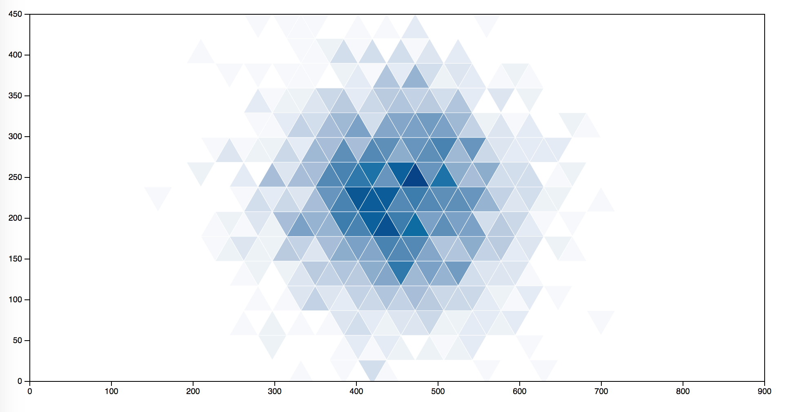
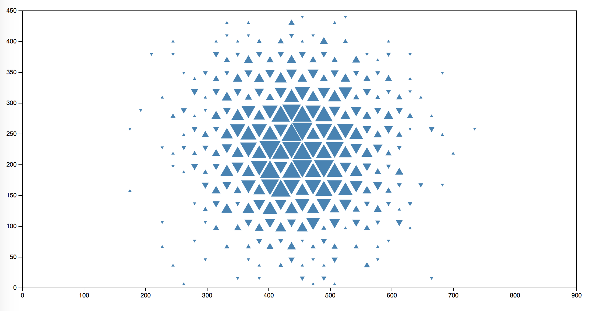

# d3-tribin

This D3 plugin is largely inspired by the [d3-hexbin](https://github.com/d3/d3-hexbin) plugin but instead of using hexagons to bin points it uses triangles. It is therefore used to group two-dimensional points into (equilateral) triangular bins. It supports color encoding, area encoding, or both.

[](https://bl.ocks.org/mfilippo/26c47af10022bbad1396b8170fd1f1d6) [](https://bl.ocks.org/mfilippo/6276f2eccaf0aaba1ef8061e4e12c3f3)

## Installing

If you use NPM, `npm install d3-tribin`. Otherwise, download the [latest release](https://github.com/mfilippo/d3-tribin/releases/latest).

## API Reference

<a href="#tribin" name="tribin">#</a> <b>tribin</b>()

Constructs a new default [tribin generator](#_tribin).

<a name="_tribin" href="#_tribin">#</a> <i>tribin</i>(<i>points</i>)

Bins the specified array of *points*, returning an array of triangular *bins*. For each point in the specified *points* array, the [*x*-](#tribin_x) and [*y*-](#tribin_y)accessors are invoked to compute the *x*- and *y*-coordinates of the point, which is then used to assign the point to a triangular bin. If either the *x*- or *y*-coordinate is NaN, the point is ignored and will not be in any of the returned bins.

Each bin in the returned array is an array containing the bin’s points. Only non-empty bins are returned; empty bins without points are not included in the returned array. Each bin has these additional properties:

* `x` - the *x*-coordinate of the center of the associated bin’s triangle
* `y` - the *y*-coordinate of the center of the associated bin’s triangle
* `rotation` - the rotation (in gradients) with respect to the vertical axe of the associated bin’s triangle

The *x*- and *y*-coordinates of the triangle center and its *rotation* can be used to render the triangle at the appropriate location in conjunction with [*tribin*.triangle](#tribin_triangle) or [*tribin*.triangleFromBin](#tribin_triangleFromBin) or . For example, given a tribin generator:

```js
var tribin = d3.tribin();
```

You could display a triangle for each non-empty bin as follows:

```js
svg.selectAll("path")
  .data(tribin(points))
  .enter().append("path")
    .attr("d", function(d) { return tribin.triangleFromBin(d); });
```

Which is equivalent to:

```js
svg.selectAll("path")
  .data(tribin(points))
  .enter().append("path")
    .attr("d", function(d) { return tribin.triangle(1, d.rotation, [d.x, d.y]); });
```

And also equivalent to:

```js
svg.selectAll("path")
  .data(tribin(points))
  .enter().append("path")
    .attr("d", function(d) { return "M" + d.x + "," + d.y + tribin.triangle(1, d.rotation); });
```

<a name="tribin_triangleFromBin" href="#tribin_triangleFromBin">#</a> <i>tribin</i>.<b>triangleFromBin</b>(<i>bin</i>, [<i>side</i>])

Returns the SVG path string for the (equilateral) triangle with default size. The center and the rotation of the triangle are automatically set by using the *bin* properties *x*, *y* and *rotation*. If *side* is not specified, the tribin’s [current side](#tribin_side) is used. If *side* is specified, a triangle with the specified side is returned, this is useful for area-encoded bivariate tribins.

<a name="tribin_triangle" href="#tribin_triangle">#</a> <i>tribin</i>.<b>triangle</b>([<i>side</i>], [<i>rotation</i>], [<i>center</i>])

Returns the SVG path string for the (equilateral) triangle with default size, zero rotation and centered at the origin ⟨0,0⟩. The path string is defined with relative coordinates such that you can easily translate the triangle to the desired position. If *side* is not specified, the tribin’s [current side](#tribin_side) is used. If *side* is specified, a triangle with the specified side is returned. If *rotation* is not specified, zero is used. If *rotation* is specified, a triangle with the specified rotation is returned. The rotation is applied clockwise and specified in radians (e.g. 180 degrees correspond to `Math.PI` rad). If *center* is not specified, the triangle is centered at ⟨0,0⟩. If *center* is specified, the triangle will be centered at ⟨`center[0]`,`center[1]`⟩.

<a name="tribin_x" href="#tribin_x">#</a> <i>tribin</i>.<b>x</b>([<i>x</i>])

If *x* is specified, sets the *x*-coordinate accessor to the specified function and returns this tribin generator. If *x* is not specified, returns the current *x*-coordinate accessor, which defaults to:

```js
function x(d) {
  return d[0];
}
```

The *x*-coordinate accessor is used by [*tribin*](#_tribin) to compute the *x*-coordinate of each point. The default value assumes each point is specified as a two-element array of numbers [*x*, *y*].

<a name="tribin_y" href="#tribin_y">#</a> <i>tribin</i>.<b>y</b>([<i>y</i>])

If *y* is specified, sets the *y*-coordinate accessor to the specified function and returns this tribin generator. If *y* is not specified, returns the current *y*-coordinate accessor, which defaults to:

```js
function y(d) {
  return d[1];
}
```

The *y*-coordinate accessor is used by [*tribin*](#_tribin) to compute the *y*-coordinate of each point. The default value assumes each point is specified as a two-element array of numbers [*x*, *y*].

<a name="tribin_side" href="#tribin_side">#</a> <i>tribin</i>.<b>side</b>([<i>side</i>])

If *side* is specified, sets the side of the triangle to the specified number. If *side* is not specified, returns the current side, which defaults to 1.